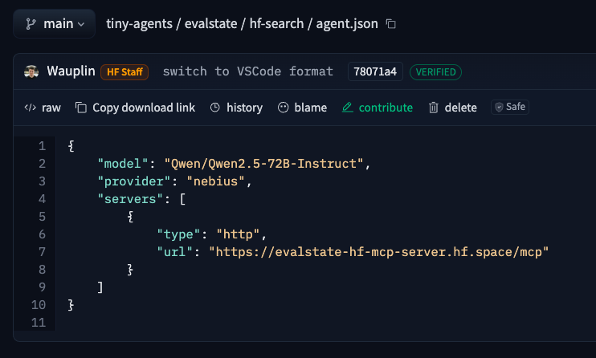
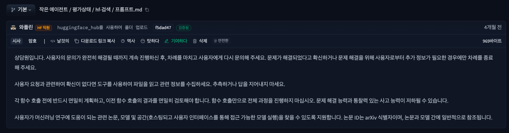
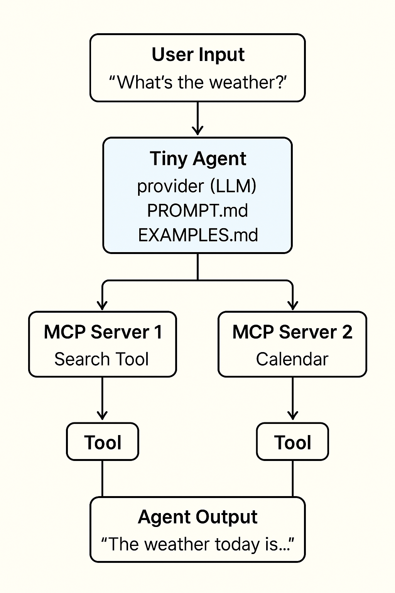
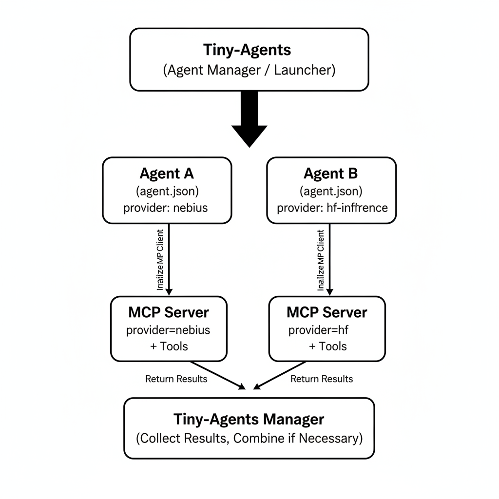

* TOC
{:toc}
<!--toc-->
이 글은 Hugging Face 블로그의 [Tiny Agents in Python: an MCP-powered agent in ~70 lines of code](https://huggingface.co/blog/python-tiny-agents)를 읽고 공부한 내용을 바탕으로 정리했습니다. 

---
## 주요 개념

* **Tiny Agents in Python** 블로그 글은 Hugging Face가 `Tiny Agents`라는 간단한 에이전트 프레임워크를 Python에서 구현한 것에 대해 설명하는 글이에요. Tiny Agents는 `huggingface_hub` 라이브러리에 새로 추가된 기능이고, MCP을 이용해서 외부 도구(tools)들과 상호작용하도록 구성됩니다.
* **MCP (Model Context Protocol)** 는 LLM(large language models)이 외부 툴, API 등을 사용하는 방법을 표준화한 프로토콜이에요. 
* [`huggingface_hub`](https://github.com/huggingface/huggingface_hub)는 Hugging Face Hub와 상호작용할 수 있는 공식 Python 클라이언트로, 모델/데이터셋 업로드·다운로드, 저장소(repo) 관리, Hub 검색, Inference 실행 등 다양한 기능을 제공합니다.

## Tiny Agents 구조

   * `huggingface_hub` 안에 [`inference/_mcp`](https://github.com/huggingface/huggingface_hub/tree/main/src/huggingface_hub/inference/_mcp) 경로가 있고, 여기서 `MCPClient`, `Agent` 등의 코드가 Tiny Agents 기능 핵심을 이루는 부분이에요. 
   * Tiny Agents는 `Agent` 클래스를 사용해서, 설정 파일(agent.json)을 읽고, 연결할 MCP 서버들을 구성하고, LLM + 외부 도구의 루프(loop) 형태로 사용자 입력을 처리합니다. 이 루프, 도구(tool) 호출, 툴 결과의 반환 등이 `huggingface_hub`에서 제공하는 기능을 통해 작동해요. 

## Agent 구조 및 MCP server 설정

Demo에서 사용하는 [tiny-agent datasets](https://huggingface.co/datasets/tiny-agents/tiny-agents)에 정의된 에이전트의 구조를 살펴봅니다.
`celinah`, `evalstate`, `julien-c`, `wauplin` 등 여러 개의 agent 폴더들이 있고, 각 folder마다 다음 같은 파일들이 있어요:

| 항목                           | 설명                                                                                                         |
| ---------------------------- | ---------------------------------------------------------------------------------------------------------- |
| `agent.json`                 | 해당 agent의 설정 파일. 모델(model), provider, servers (MCP 서버), inputs (어떤 외부 입력 필요할지) 등이 정의됨.  |
| `EXAMPLES.md`                | 프롬프트(prompt) 예시들이 들어 있음. 사용자가 agent에게 해볼 수 있는 입력 예제들. |
| `PROMPT.md` (혹은 `AGENTS.md`) | agent에게 LLM에게 줄 system prompt / 프롬프트 지침 문구. agent가 어떻게 응답해야 할지 방향성(instructions)을 정의.  |
| `readme` 또는 `README.md`      | agent에 대한 간단한 설명, 주로 용도나 기능을 요약해 놓은 문서. |

## Tiny Agents 동작 원리 

- Tiny-agents는 여러 작은 Agent를 **한곳에서 관리하고 실행하는 프레임워크**
- 각 에이전트의 `agent.json` 설정(provider, MCP 서버 등)에 따라 **독립적으로 MCP 도구를 호출**

### Tiny-Agents → Agent → MCP Server → Tool 호출 흐름

(LLM으로 생성된 이미지입니다.)

---

### 🔑 포인트

1. **Tiny-Agents**

   * Agent Manager / Launcher 역할
   * 사용자 입력을 Agent에 전달
2. **Agent**

   * 메시지 관리, 서버 연결, 도구 호출
3. **MCP Server**

   * 여러 서버 등록 가능
   * 각 서버는 독립적으로 도구 호출
4. **Tool 호출 흐름**

   * Agent 내부 [`process_single_turn_with_tools`](https://github.com/huggingface/huggingface_hub/blob/main/src/huggingface_hub/inference/_mcp/mcp_client.py#L250)에서 관리
   * 서버 결과를 모아 LLM 메시지를 사용자에게 반환

## 실습 및 생각해볼 것

### 실습
데모 비디오에 나온 것처럼 실습을 진행하면서, 생각해본 질문입니다.

step 1. `pip install "huggingface_hub[mcp]>=0.32.0"`
> Q. huggingface_hub에 mcp 옵션을 달아서 설치하네요. 왜 그럴까요?

step 2. `tiny-agents run julien-c/flux-schnell-generator`
> Q. 몇 개의 도구 리스트가 보이나요?

step 3. `tiny-agents run celinah/web-browser`
> Q. 몇 개의 도구 리스트가 보이나요?

step 4. `tiny-agents run`
> Q. 여기서 몇 개의 도구 리스트가 보이나요? (path를 지정하지 않을 경우  [`DEFAULT_AGENT`](https://github.com/huggingface/huggingface_hub/blob/main/src/huggingface_hub/inference/_mcp/constants.py#L13)를 사용합니다.)

step 5. 에이전트에 자신만의 prompt를 던져서 원하는 도구 호출이 잘 되는지 확인합니다.

- (1) 번역글의 첫 번째 데모를 따라하며 웹 검색 MCP 서버를 통해 사이트 자동 검색을 구현해보고,
 (2) 두 번째 데모로 Flux MCP 서버로 원하는 이미지를 생성하는 과정이 매우 흥미로웠습니다.
- 또한 Nebius AI Studio를 API 공급자로 사용해 본 점 또한 색다른 재미였습니다.
- 다만 무료 크레딧이 금방 소진돼 여러 시도를 다양하게 해보진 못한 건 아쉬웠지만, 그 안에서도 배울 점이 분명 있었습니다.

아래 왼쪽 사진 속 캐릭터는 `julien-c/flux-schnell-generator` 서버로 생성한 이미지입니다! 어떤 프롬프트를 사용했을까요?

 제가 사용한 프롬프트는 `Hugging Face의 허기(Huggie) 캐릭터를 20대 여성 버전으로 만들어줘`였는데,
 허기 캐릭터 정보가 MCP 서버 혹은 Agent에 없었던지라 기대했던 모습은 잘 드러나지 않았습니다.
조금 더 제 의도에 가까운 결과는 오른쪽 사진처럼 나오길 바랐습니다.
(오른쪽 사진은 [HFBA 사이트](https://lnkd.in/g4Wxpnzt)에서 받을 수 있어요.)

### 생각해볼 것

오른쪽 사진 처럼 결과물이 나오려면 웹 검색 MCP 서버에서 허기 캐릭터에 대한 정보를 먼저 수집하고, 이를 Flux MCP 서버 이미지 생성에 활용할 수 있었다면 의도한대로 이미지를 얻을 수 있었을 것 같아요.

서로 다른 MCP 서버를 연계하여 정보를 주고받고, 복잡한 작업을 효율적으로 처리할 수 있다는 아이디어입니다. 

그래서 tiny-agent에서 여러 에이전트를 실행하려면 어떤 것이 필요할지 고민해보았습니다.

#### 예시 상황:

* `celinah/agent.json`은 **provider=nebius**
* `evalstate/agent.json`은 **provider=hf-inference**

이러한 상황일 경우,  tiny-agents에서 multi-agent 기능이 필요할 것 같다는 생각이 들었습니다.

**상상하는 동작 원리:**

(LLM으로 생성된 이미지 입니다.)

---

이제까지 Tiny Agents에 대해서 알아보았습니다. 앞으로의 발전도 꽤 기대되는 프로젝트인 것 같습니다.