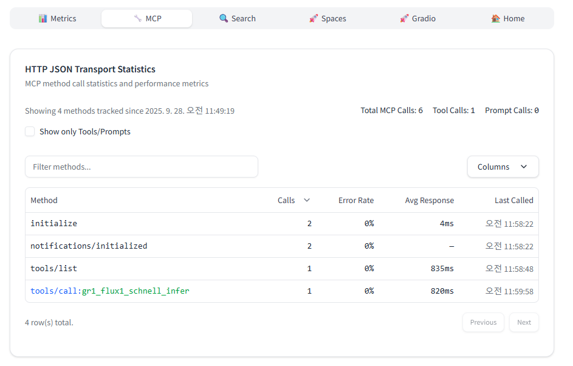

* TOC
{:toc}
<!--toc-->

이 글은 Hugging Face 블로그의 [Building the Hugging Face MCP Server](https://huggingface.co/blog/building-hf-mcp)를 읽고 공부한 내용을 바탕으로 정리했습니다. 

---
## 주요 개념
| 원문 용어 (English)            | 번역 용어 (Korean)               |
| ---------------------------- | ---------------------------- |
| Model Context Protocol (MCP) | 모델 컨텍스트 프로토콜(MCP)            |
| STDIO                        | STDIO                        |
| HTTP with SSE                | HTTP with SSE                     |
| Server Sent Events (SSE)     | 서버 전송 이벤트                    |
| Streamable HTTP              | Streamable HTTP                 |
| Direct Response              | 직접 응답                        |
| Request Scoped Streams       | 요청 범위 스트림                    |
| Server Push Streams          | 서버 푸시 스트림                    |
| Stateless                    | 무상태                          |
| Stateful                     | 상태 유지                        |
| Session Affinity             | 세션 어피니티                      |
| Sampling                     | 샘플링                          |
| Elicitation                  | 추가 정보 요청                     |


## MCP 서버 설계 의사결정 흐름 (블로그 글 기준)
1. 어떤 전송 방식을 쓸지 (Transport, 전송 방식)
    * STDIO: 로컬 실행, 개발/테스트 환경에 적합
    * HTTP with SSE: 과거 원격 표준, 현재는 Streamable HTTP로 대체됨
    * Streamable HTTP: 최신 원격 전송 방식. 요청/응답 + 스트리밍 모두 가능

2. 어떤 데이터 흐름 패턴을 선택할지 (Communication Pattern, 통신 방식)
    * Direct Response: 단순 요청-응답. 가볍고 빠름
    * Request Scoped Streams: 요청 단위 스트리밍. 진행 상황·추가 요청(Elicitation) 가능
    * Server Push Streams: 장기 연결. 서버가 능동적으로 알림·변경사항 푸시

3. 상태를 유지할지 여부 (State Management, 상태 관리)
    * Stateless: 각 요청 독립 처리. 확장성 높음, 관리 단순
    * Stateful: 서버가 세션 유지. 세션 ID·세션 어피니티 필요, 재개(Resumption) 지원 가능

4. 상호작용 기능을 지원할지 (Interactive Features)
    * Sampling: 서버가 선택지를 제공, 클라이언트가 선택
    * Elicitation: 서버가 클라이언트에 추가 정보 요청
    * Progress Notification: 요청 범위 스트림에서 진행 상황을 알림


## 1. **전송(Transport) 방식**
* **STDIO**
  로컬 환경에서 MCP 서버와 클라이언트가 같은 컴퓨터에서 실행될 때, 표준 입출력으로 통신하는 방식.
  → 로컬 개발/테스트용
```
클라이언트 프로세스                          서버 프로세스
    |                                       |
    |-- STDIN: initialize ----------------->|
    |<-- STDOUT: initialized ---------------|
    |-- STDIN: tools/call ----------------->|
    |<-- STDOUT: result --------------------|
    |-- STDIN: tools/call ----------------->|
    |<-- STDOUT: result --------------------|
```

* **HTTP with SSE (서버 전송 이벤트)**
  서버가 열린 HTTP 연결을 유지하며 클라이언트로 이벤트를 지속 전송하는 방식.
  → 과거 원격 표준, 현재는 사용 중단 추세
```
클라이언트                                   서버
   |                                         |
   |-- POST /initialize -------------------->|
   |<-- 200 OK (세션/설정) -------------------|
   |-- GET /events (Accept: text/event-stream)|
   |<== SSE: ready/heartbeat/updates =======|
   |                                         |
   |-- POST /tools/call -------------------->|
   |<== SSE: progress/output/done ==========|
```

* **Streamable HTTP**
  최신 원격 통신 방식. 요청/응답뿐 아니라 스트리밍도 가능해 유연성이 높음. SSE의 진화된 형태.
  → 현재 MCP 프로덕션 환경에서 권장


## 2. **통신 방식(Communication Patterns) - Streamable HTTP***
* **Direct Response (직접 응답)**
```
클라이언트                                  서버
   |                                    |
   |-- POST /initialize --------------->|   (옵션: Stateless면 세션ID 없음)
   |<-- 200 OK -------------------------|
   |                                    |
   |-- POST /tools/call --------------->|   (질문1/툴 호출)
   |<-- 200 OK (결과1 본문) -------------|
   |                                    |
   |-- POST /tools/call --------------->|   (질문2/툴 호출)
   |<-- 200 OK (결과2 본문) -------------|
```

* **Request Scoped Streams (요청 범위 스트림)**
  특정 요청에 한정된 임시 스트리밍. 작업 중간에 **진행 상황 알림, 추가 정보 요청** 가능.
```
클라이언트                                  서버
   |                                    |
   |-- POST /initialize --------------->|   (Stateful일 경우 세션ID 발급)
   |<-- 200 OK (mcp-session-id=abc123)--|
   |                                    |
   |-- POST /tools/call (abc123) ------>|   (질문1)
   |<-- 202 Accepted (request_id=r1) ---|
   |                                    |
   |-- GET  /streams/r1 --------------->|   (SSE 구독, Accept: text/event-stream)
   |<== SSE: progress 10% ==============|
   |<== SSE: progress 80% ==============|
   |<== SSE: output(답변1) =============|
   |<== SSE: done ======================|
   |                                    |
   |-- POST /tools/call (abc123) ------>|   (질문2)
   |<-- 202 Accepted (request_id=r2) ---|
   |-- GET  /streams/r2 --------------->|
   |<== SSE: progress ... ==============|
   |<== SSE: output(답변2) =============|
   |<== SSE: done ======================|
```

* **Server Push Streams (서버 푸시 스트림)**
  장기 연결을 유지하며 서버가 능동적으로 알림/메시지를 보냄
  → 도구 목록 변경 알림, 구독 이벤트 등에 활용. 관리가 복잡함
```
클라이언트                                  서버
   |                                    |
   |-- POST /initialize --------------->|   (Stateful 권장)
   |<-- 200 OK (mcp-session-id=abc123)--|
   |                                    |
   |-- GET  /events?session=abc123 ---->|   (장기 SSE 연결)
   |<== SSE: tool_list_changed =========|
   |<== SSE: resource/update ===========|
   |                                    |
   |-- POST /tools/call (abc123) ------>|   (질문1)
   |<-- 202 Accepted (request_id=r1) ---|
   |<== SSE: progress ... ==============|   (같은 장기 스트림으로 푸시)
   |<== SSE: output(답변1) =============|
   |                                    |
   |-- POST /tools/call (abc123) ------>|   (질문2)
   |<-- 202 Accepted (request_id=r2) ---|
   |<== SSE: output(답변2) =============|
   |<== SSE: ping/keep-alive ===========|
```

## 3. **상태 관리(State Management)**
* **Stateless (무상태)**
  요청 간 연결된 상태를 유지하지 않음. 확장성이 뛰어나지만 맥락은 클라이언트가 직접 전달해야 함

* **Stateful (상태 유지)**
  서버가 클라이언트의 세션을 기억. 세션 ID(mcp-session-id)를 발급하여 맥락을 이어갈 수 있음

* **Session Affinity (세션 어피니티)**
  Stateful 구조에서 특정 클라이언트 요청을 항상 같은 서버 인스턴스로 보장하는 방식
    * 로드밸런서가 세션 쿠키, 세션 ID, 혹은 IP 기반으로 동일 서버에 붙여줌

* **Resumption (재개)**
  연결이 끊겼다가 다시 이어질 때, 이전 세션 상태를 복원하는 기능
    * keep-alive 실패 → 연결 끊김 → 재개(resumption) 메커니즘이 동작


## 4. **상호작용/확장 기능**
* **Sampling (샘플링)**
  서버가 클라이언트에 선택지를 주고, 그 중 하나를 고르도록 요청
    * 예: "이 제목 후보 중 하나 고르기", "짧은 요약 문구 만들기"
    * 자동화된 결정이 필요할 때 사용

* **Elicitation (추가 정보 요청)**
  서버가 클라이언트에게 누락된 입력이나 추가 옵션을 요구
    * 예: "동영상 길이를 입력해주세요", "정말 삭제하시겠습니까?"
    * 사람이 직접 확인·선택해야 하는 상황에 사용


## 시연
### 로컬
1. HuggingFace MCP 서버 기동
```
$ docker build --no-cache -t hf-mcp-server:latest .
$ docker run --rm -p 3000:3000 hf-mcp-server:latest
```

```
$ docker run --rm -p 3000:3000 hf-mcp-server:lf
Starting MCP server with transport type: streamablehttpjson on port 3000
Using standard HF_TOKEN authentication.
Using streamableHttpJson transport type (JSON response mode enabled)
{"level":30,"time":"2025-09-28T02:49:19.177Z","pid":11,"hostname":"179a01035eed","msg":"Starting Streamable HTTP server..."}
{"level":30,"time":"2025-09-28T02:49:19.177Z","pid":11,"hostname":"179a01035eed","msg":"JSON response mode enabled"}
{"level":30,"time":"2025-09-28T02:49:19.178Z","pid":11,"hostname":"179a01035eed","msg":"Using internal API client with user config API: http://localhost:3000}"}
{"level":30,"time":"2025-09-28T02:49:19.181Z","pid":11,"hostname":"179a01035eed","msg":"Server running at http://localhost:3000"}
{"level":30,"time":"2025-09-28T02:49:19.181Z","pid":11,"hostname":"179a01035eed","transportType":"streamableHttpJson","mode":"production","msg":"Server configuration"}   
{"level":30,"time":"2025-09-28T02:49:19.181Z","pid":11,"hostname":"179a01035eed","msg":"HTTP JSON transport initialized (stateless mode)"}
{"level":30,"time":"2025-09-28T02:49:19.182Z","pid":11,"hostname":"179a01035eed","msg":"Starting API polling with interval 5000ms"}
```


2. HuggingFace MCP 명령어 테스트
```
$ npx mcp-remote http://localhost:3000/mcp --interactive
```

- 도구 목록 호출
```
$ npx mcp-remote http://localhost:3000/mcp --interactive
[34228] Using automatically selected callback port: 4208
[34228] [34228] Connecting to remote server: http://localhost:3000/mcp
[34228] Using transport strategy: http-first
[34228] Connected to remote server using StreamableHTTPClientTransport
[34228] Local STDIO server running
[34228] Proxy established successfully between local STDIO and remote StreamableHTTPClientTransport
[34228] Press Ctrl+C to exit
{"jsonrpc":"2.0","id":1,"method":"tools/list","params":{}}
[34228] [Local→Remote] tools/list
[34228] [Remote→Local] 1
{"jsonrpc":"2.0","id":1,"result":{"tools":[{"name":"hf_whoami","description":"Hugging Face tools are being used anonymously and may be rate limited. Call this tool for instructions on joining and authenticating.","inputSchema":{"type":"object","properties":{},"additionalProperties":false,"$schema":"http://json-schema.org/draft-07/schema#"},"annotations":{"title":"Hugging Face User Info"}} ...
```

- 이미지 생성 모델 호출
```
{  "jsonrpc": "2.0",  "id": 2,  "method": "tools/call",  "params": {    "name": "gr1_flux1_schnell_infer",    "arguments": {      "prompt": "고양이가 책상 위에 앉아있는  일러스트"    }  }}
[34228] [Local→Remote] tools/call
[34228] [Remote→Local] 2
{"jsonrpc":"2.0","id":2,"result":{"content":[{"type":"image","data":"...","mimeType":"image/webp"},{"type":"text","text":"Image URL: https://evalstate-flux1-schnell.hf.space/gradio_api/file=/tmp/gradio/644adb3a95a6d8a02ed911a004ef00544749d5dc899e36679fd1266dad7ce4f0/image.webp"},{"type":"text","text":"1134957760"}],"isError":false}}
```




### Claude Desktop
1. Claude Desktop 내 MCP 서버 설정 추가
claude_desktop_config.json
```
    "huggingface": {
      "command": "npx",
      "args": [
        "mcp-remote",
        "http://localhost:3000/mcp"
      ],
      "env": {
        "HF_TOKEN": "hf_~"
      }
    }
```

2. HuggingFace MCP 테스트
- 도구 목록 호출


- 데이터셋, 모델, 스페이스 검색


- 이미지 생성 모델 호출


